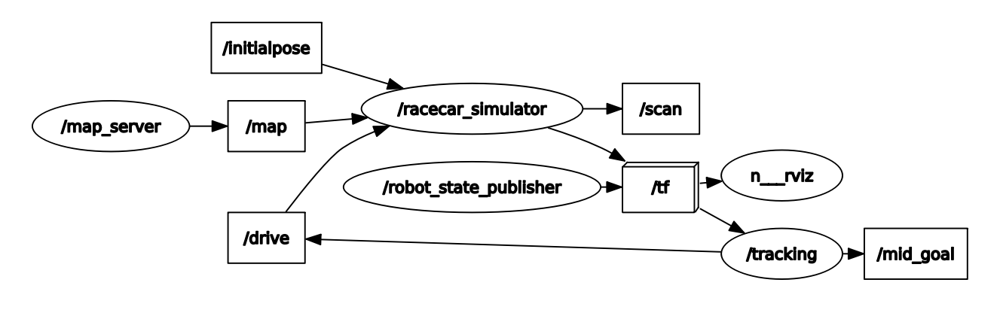
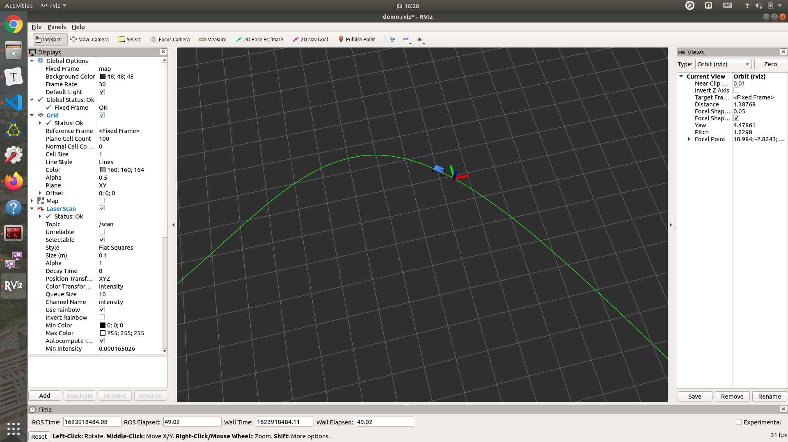

# Plan & Progress

## Progress

### week 7

- 下载运行了MIT racecar_simulator代码，往里整合了pure pursuit轨迹跟踪算法后在rviz里进行了仿真

  仿真程序节点图：

  

  

- 购买了STM32板（周五会到），基本完成了底层控制部分代码（未调试）

## Plan

- 以STM32为下位机调好底层控制部分（对舵机的控制、对电机的转速反馈控制）
- 实现上下位机之间的通讯部分
- 了解阿克曼底盘赛车的路径规划部分，将路径规划算法整合进仿真包里
- 将仿真代码迁移到实车，利用动捕系统测试其跟踪效果和精度

## Undetermined

- 通过手柄遥控小车功能实现（？）

  键盘直连树莓派完全正常。因为目前通过监测键盘输入的方法通过nomachine（不能用ssh）会出现时间滞后和不存在的键盘松开情况。且抱着键盘走来走去不现实，考虑仿照其他项目完成用手柄遥控小车的功能，或者改进键盘遥控功能

  可能有用的仓库：https://github.com/ros-teleop/teleop_tools
  
