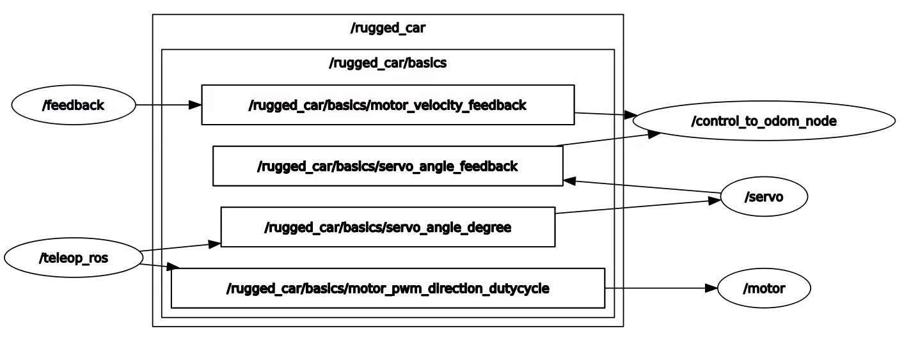

# Plan & Progress

## Progress

### week 6

- mounting plate打印

  根据尺寸先用SolidWorks画图并导出DWG文件，已交给淘宝制作中

- 将程序使用的GPIO库从RPi.GPIO迁移到pigpio，enable ROS包的编写（原来的库无法用ROS控制）

- 编写了读取编码器信息的结点，输出电机速度（rpm）

- 编写了odometry节点，读取装在电机上的编码器信息和舵机角度命令，输出nav_msgs的Odom消息类型，即里程计估计的当前位姿

- 初步建立了ROS包，建立了控制电机和舵机的节点和话题，优化了键盘的控制逻辑

  

- 针对电机的转速控制编写了基本的PID控制脚本

## Plan

- 将[阿克曼底盘信息](http://wiki.ros.org/ackermann_msgs)解算成舵机和电机控制信号

  逻辑即里程计的逆逻辑，仅需完成传动比例的测量和代码编写

- 调节电机的PID控制参数

- 高层的选型和方向问题

## Undetermined

- 通过手柄遥控小车功能实现（？）

  键盘直连树莓派完全正常。因为目前通过监测键盘输入的方法通过nomachine（不能用ssh）会出现时间滞后和不存在的键盘松开情况。且抱着键盘走来走去不现实，考虑仿照其他项目完成用手柄遥控小车的功能，或者改进键盘遥控功能

  可能有用的仓库：https://github.com/ros-teleop/teleop_tools
  
- 电机闭环控制

  其实能做，已经写了原始的PID控制器，但是视后续规划的情况而定，如果规划可以输出电机转速再写
