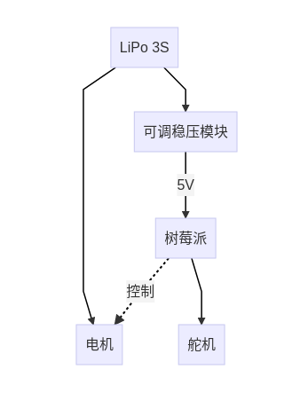

# Plan & Progress

## Progress

### week 5

- 舵机测试完成

  现可用树莓派控制舵机转动角度部分

- 电路连接完成

  
  
  注意可调稳压模块配有显示，用螺丝刀调节其电位器使其输出为5V；
  
  所用线缆：
  
  USB type-C供电线，要用USB type-C头焊接，另一头接稳压
  
  稳压输入的线另一头接XT30U-F头，一条两头都是XT60-M的线连接一分为二的线

- 树莓派ROS安装完成

- 完成了车辆相关尺寸的测量

- 编码器购买

- 已将电机与电池、舵机固定到车上，可用树莓派通过nomachine远程用键盘指令遥控车辆进行移动

## Plan

- mounting plate打印

  参考：https://github.com/mit-racecar/hardware 

  根据尺寸先用SolidWorks画图并导出DWG文件，交给淘宝订做一个亚克力板先用着，器件先尝试用扎带固定

- 通过手柄遥控小车功能实现（？）

  因为目前通过监测键盘输入的方法只能通过nomachine（不能用ssh），且输入会出现时间滞后和不存在的键盘松开情况，且抱着键盘走来走去不现实，考虑仿照其他项目完成用手柄遥控小车的功能，或者改进键盘遥控功能

  可能有用的仓库：https://github.com/ros-teleop/teleop_tools

- 将[阿克曼底盘信息](http://wiki.ros.org/ackermann_msgs)解算成舵机和电机控制信号

  参考：https://github.com/mit-racecar/vesc/tree/master/vesc_ackermann

  为了便于测试我们还需要从键盘读入信息并发布到相应话题的程序，这部分可以参考MIT的包（[模拟部分](https://github.com/mit-racecar/racecar_gazebo)无法单独运行，需要[车辆底层控制](https://github.com/mit-racecar/racecar)部分），为了方便我把目前能运行的仿真部分上传到这里，按照readme操作即可，然后理解其代码部分并改装到我们的车上。可运行的代码包已经重新上传到MIT_code_part1

- 电机闭环控制

  设计编码器的安装结构并制作、编写PID控制脚本

